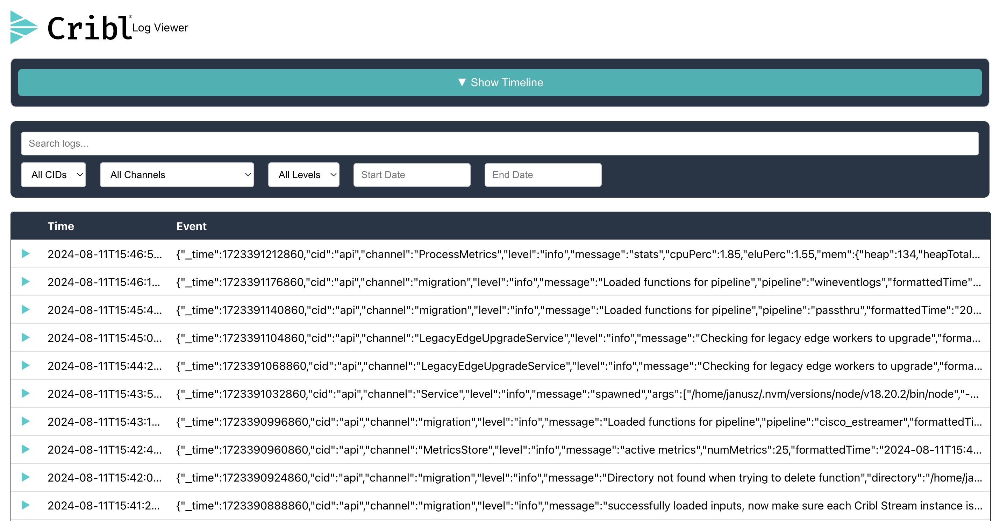

# Cribl Log Viewer
A React application for viewing and filtering logs with advanced filtering options and a visual timeline chart. This app fetches logs from a provided URL, displays them in a table, and provides several filtering mechanisms, including search term, CID, channel, log level, and date range. The application is optimized with lazy loading, debounce handling, and efficient data fetching using custom React hooks.



## Demo


## Features

- **Log Fetching**: Fetches log data from a specified URL.
- **Advanced Filtering**: Filter logs by search term, CID, channel, log level, and date range.
- **Lazy Loading**: Loads logs progressively as the user scrolls to improve performance with large datasets.
- **Debounce Search**: Debounces the search term input to prevent unnecessary re-renders while typing.
- **Custom Hooks**: Modular hooks for fetching and filtering logs (`useFetchLogs`, `useFilteredLogs`).
- **Visual Timeline**: A timeline chart of log counts over time, using AntV G2Plot.
- **Responsive UI**: The app adjusts to different screen sizes with CSS custom properties.

## Table of Contents

- [Installation](#installation)
- [Usage](#usage)
- [Development](#development)
- [Testing](#testing)
- [File Structure](#file-structure)
- [Technologies Used](#technologies-used)

## Installation

### Clone the Repository

```bash
git clone https://github.com/your-username/cribl-log-viewer.git
cd cribl-log-viewer
```

### Install Dependencies

```bash
yarn install
```

## Usage

1. Update the log source URL inside `App.tsx`:

```javascript
const { logEntries, loading, error } = useFetchLogs('https://s3.amazonaws.com/io.cribl.c021.takehome/cribl.log');
```

2. Start the development server:

```bash
yarn start
```

3. Open your browser and navigate to `http://localhost:3000`.

### Filtering Options

- **Search Term**: Filter logs based on a search term.
- **CID**: Select a CID from the dropdown to filter logs by CID.
- **Channel**: Filter logs based on the channel they originated from.
- **Log Level**: Filter logs based on their severity (info, error, etc.).
- **Date Range**: Select a start and end date to filter logs within a specific date range.

### Visual Timeline

The timeline chart visualizes the number of logs over time. It uses the `AntV G2Plot` library for rendering a column chart that allows the user to explore log trends.

## Development

### File Structure

```bash
├── App.css
├── App.test.tsx
├── App.tsx
├── components
│   ├── CriblLogo
│   │   ├── CriblLogo.css
│   │   ├── CriblLogo.test.tsx
│   │   └── index.tsx
│   ├── LogFilter
│   │   ├── LogFilter.css
│   │   ├── LogFilter.test.tsx
│   │   └── index.tsx
│   ├── LogViewer
│   │   ├── LogRow.tsx
│   │   ├── LogViewer.css
│   │   ├── LogViewer.test.tsx
│   │   └── index.tsx
│   └── Timeline
│       ├── Timeline.css
│       ├── Timeline.test.tsx
│       ├── TimelineChart.tsx
│       └── index.tsx
├── helpers
│   ├── fetchLogs.tsx
│   └── logWorker.js
├── hooks
│   ├── useDebounce.test.tsx
│   ├── useDebounce.tsx
│   ├── useFetchLogs.tsx
│   ├── useFetchLogs.test.tsx
│   ├── useFilteredLogs.test.tsx
│   ├── useFilteredLogs.tsx
│   ├── useG2PlotColumn.test.tsx
│   ├── useG2PlotColumn.tsx
│   ├── useLogWorker.test.tsx
│   └── useLogWorker.tsx
├── index.css
├── index.tsx
├── logo.svg
├── react-app-env.d.ts
├── reportWebVitals.ts
├── setupTests.ts
└── types
    └── LogEntry.tsx
```

### Key Components

- **LogViewer**: Displays the list of log entries, with expandable rows for detailed log data.
- **LogFilter**: A filtering UI component allowing users to filter logs by search term, CID, channel, level, and date range.
- **Timeline**: A chart component that visualizes log data trends using `AntV G2Plot`.

### Custom Hooks

- **`useFetchLogs`**: Fetches log data from the given URL and handles loading/error states.
- **`useFilteredLogs`**: Filters logs based on search term, selected CID, channel, log level, and date range.

## Testing

Testing is done using `@testing-library/react` and `Jest`.

### Running Tests

To run the unit tests, use the following command:

```bash
yarn test
```

### Example Test

The `App.test.tsx` file includes tests for rendering components and applying filters:

```javascript
test('renders CriblLogo and Log Viewer components', async () => {
  render(<App />);
  expect(screen.getByText('Log Viewer')).toBeInTheDocument();
});
```

## Technologies Used

- **React**: Frontend framework for building the user interface.
- **TypeScript**: For static type checking and improving code quality.
- **AntV G2Plot**: Used for rendering the timeline chart.
- **@testing-library/react**: Testing utilities for rendering and interacting with components in tests.
- **Jest**: JavaScript testing framework for running unit tests.

## Contributing

1. Fork the repository.
2. Create a new branch (`git checkout -b feature/your-feature`).
3. Commit your changes (`git commit -m 'Add some feature'`).
4. Push the branch (`git push origin feature/your-feature`).
5. Open a Pull Request.

## License

This project is licensed under the MIT License.
